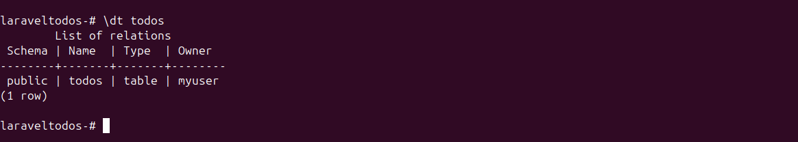

**TEST CASES - Laravel REST API with PostgreSQL & Keycloak**

**Submitted By**  
Pravesh, Abhishek

**Submitted To**  
Vipin Tripathi  

**Test Case Version**  
1.0

**Reviewer Name**  
Manmeet Narang, Pooja Joshi

---

## **Goal**
The purpose of these test cases is to ensure that the Laravel REST API, integrated with PostgreSQL and Keycloak authentication, functions correctly, securely, and efficiently. The test cases focus on verifying API accessibility, database interactions, authentication, data validation, error handling, and overall system performance.

---

# Table of Contents

- [TC1: API Health Check](#tc1-api-health-check)
- [TC2: Database Connection](#tc2-database-connection)
- [TC3: Create a New Todo](#tc3-create-a-new-todo)
- [TC4: Fetch All Todos](#tc4-fetch-all-todos)
- [TC5: Fetch a Specific Todo by ID](#tc5-fetch-a-specific-todo-by-id)
- [TC6: Update a Todo Item](#tc6-update-a-todo-item)
- [TC7: Delete a Todo](#tc7-delete-a-todo)


---

## **Test Environment**
- **Operating System:** Ubuntu (using Podman for containerization)
- **Backend Framework:** Laravel (PHP)
- **Database:** PostgreSQL
- **Authentication:** Keycloak
- **Server:** Laravel's built-in server Apache
- **Version Control:** Git
- **Logging & Debugging:** Laravel logs, PostgreSQL logs

---


---


## TC1: API Health Check

### Scenario

**Remarks:** Verify if the API is accessible.

### Given
- A running Laravel API server.

### When
- A GET request is sent to `/v1/`.

### Then
- The API should return a `200 OK` response.
- JSON response should contain:

```json
{
  "success": true,
  "message": "API Version 1"
}
```

### Test Run
- **Date:**
- **Result:**

### Testing outputs


---

## TC2: Database Connection

### Scenario

**Remarks:** Ensure that Laravel can connect to PostgreSQL.

### Given
- A PostgreSQL database is set up and running.

### When
- `php artisan migrate` is executed.
- `php artisan tinker` is run, and the following command is executed:

```php
DB::connection()->getPdo();
```

### Then
- No errors should occur.
- Database tables should exist (verify using `\dt todos` in psql).

### Test Run
- **Date:**
- **Result:**

### Testing outputs


---

## TC3: Create a New Todo

### Scenario

**Remarks:** Verify if a new todo item can be created.

### Given
- A running Laravel API server.

### When
- A POST request is sent to `/v1/todos` with payload:

```json
{
  "title": "Laravel-API",
  "completed": true
}
```

### Then
- Response status should be `201 Created`.
- JSON response should include the new todo with a UUID.

### Test Run
- **Date:**
- **Result:**

### Testing outputs


---

## TC4: Fetch All Todos

### Scenario

**Remarks:** Retrieve the list of todos.

### Given
- At least one todo exists in the database.

### When
- A GET request is sent to `/v1/todos`.

### Then
- Response status should be `200 OK`.
- JSON should contain a list of todos.

### Test Run
- **Date:**
- **Result:**

### Testing outputs


---

## TC5: Fetch a Specific Todo by ID

### Scenario

**Remarks:** Retrieve a single todo using its ID.

### Given
- A valid UUID of an existing todo.

### When
- A GET request is sent to `/v1/todos/{id}`.

### Then
- Response status should be `200 OK`.
- JSON contains the correct todo item.

### Test Run
- **Date:**
- **Result:**

### Testing outputs


---

## TC6: Update a Todo Item

### Scenario

**Remarks:** Modify an existing todo.

### Given
- A valid UUID of an existing todo.

### When
- A PUT request is sent to `/v1/todos/{id}` with payload:

```json
{
  "title": "Laravel-todos",
  "completed": true
}
```

### Then
- Response status should be `200 OK`.
- Updated todo should be reflected in the database.

### Test Run
- **Date:**
- **Result:**

### Testing outputs


---

## TC7: Delete a Todo

### Scenario

**Remarks:** Remove a todo from the database.

### Given
- A valid UUID of an existing todo.

### When
- A DELETE request is sent to `/v1/todos/{id}`.
- A GET request is sent to `/v1/todos/{id}`.

### Then
- Response status should be `200 OK` for deletion.
- Fetching the deleted todo should return `404 Not Found`.

### Test Run
- **Date:**
- **Result:**

### Testing outputs

